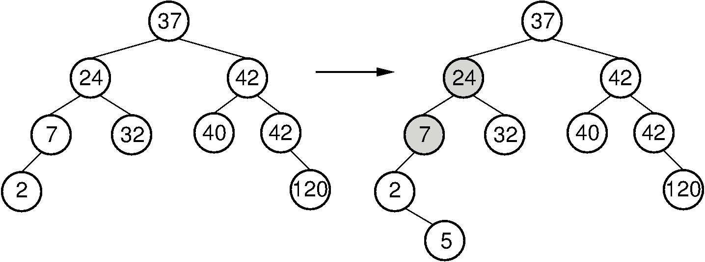

# AVL Tree (AVL Ağacı)

  AVL ağacı kendi kendisini dengeleyen İkili Arama Ağacıdır (Binary Search Tree). İkili Arama Ağacı olmasından kaynaklı olarak AVL ağacının herhangi bi düğümünün en fazla iki çocuğu (child node) olabilir ve bu düğümün sol alt ağacındaki tüm düğümler söz konusu düğümden küçükken, sağ alt ağacındaki tüm düğümler söz konusu düğümden büyüktür.

Yukarıda da belirttiğim gibi AVL ağaçları Dengeli İkili Ağaçlardır (Balanced Binary Tree). Yani her bir düğüm için sol ve sağ alt ağacın yüksekliği arasındaki farkın en fazla bir olması gerekir. Bu denge, ağaca yapılan düğüm ekleme (insertion) veya düğüm silme (deletion) işlemleri ile bozulabilir. Ağacın dengesinin bozulduğu durumlarda AVL ağaçları kendi kendilerini tekrar dengeler.

Konu hakkındaki yazıma Medium linkinden ulaşabilirsiniz: https://medium.com/@ozgurmehmetakif/avl-a%C4%9Fac%C4%B1-7e14e3afc84f

  