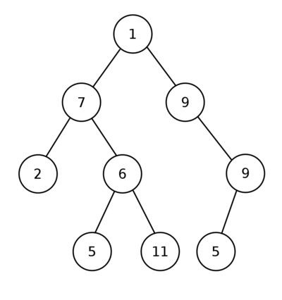

# Binary Tree (İkili Ağaç)

  İkili Ağaçlar (Binary Trees), her düğümünün (node) en fazla iki çocuğa (child) sahip olduğu özel bir Ağaç türüdür.

Konu hakkındaki yazıma Medium linkinden ulaşabilirsiniz: https://medium.com/@ozgurmehmetakif/i%CC%87kili-a%C4%9Fa%C3%A7-binary-tree-361eee2bf747

  