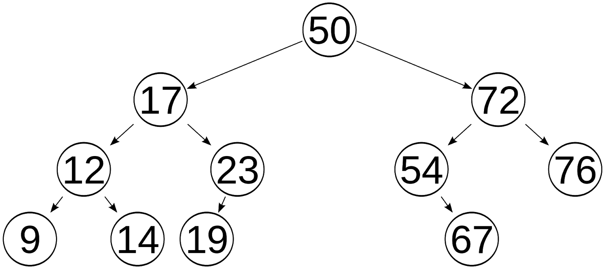

# Binary Search Tree

A Binary Search Tree is a specialized type of Binary Tree. Therefore, each node of the Binary Search Tree can have at most two children. The key distinction of a Binary Search Tree from a Binary Tree is that it has a specified ordering relationship among its elements in terms of magnitude.

In a Binary Search Tree, all nodes in the left subtree of any given node are smaller, and all nodes in the right subtree are larger than the given node. By traversing the Binary Search Tree using the Inorder Traversal method, we can sort the elements of the tree in ascending order. (9–12–14–17–19–23–50–54–67–72–76)

You can access my article on the topic through the Medium link: https://medium.com/@ozgurmehmetakif/binary-search-tree-26c1c4d65536

Konu hakkındaki yazıma Medium linkinden ulaşabilirsiniz: https://medium.com/@ozgurmehmetakif/i%CC%87kili-arama-a%C4%9Fac%C4%B1-binary-search-tree-d0ff2a487918

  
