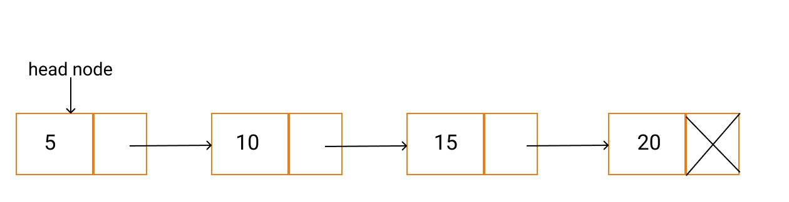

# Linked List

  
A linked list is a linear data structure consisting of a group of nodes, where each node points to the next node through a pointer.

Each node is composed of data and references/pointers to the next node(s) in the list. The last node has a "null" reference, indicating the end of the linked list.

The head node is the starting node of the linked list and contains a reference to the next node in the list. When the list is empty, the head node will have a null reference. The image above can give you an idea of how a linked list looks.

Konu hakkındaki yazıma Medium linkinden ulaşabilirsiniz: https: //medium.com/@ozgurmehmetakif/ba%C4%9Fl%C4%B1-liste-linked-list-e6326f53d527

You can access my article on the topic through the Medium link: https://medium.com/@ozgurmehmetakif/linked-list-65e7a63f8a2d
  
