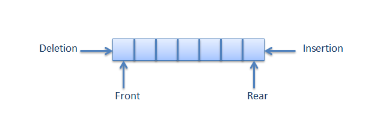

# Queue

A Queue is an abstract and linear data structure created to store data with the logic of first in, first out (FIFO), where the first element added is the first to be removed.

To give an example from everyday life, a queue in a shopping line can be an illustration of a Queue. The first customer in the queue completes their transaction first and leaves. The last customer to join the queue must wait for the customers in front of them to finish their transactions and leave before completing their own transaction and exiting the queue.

You can access my article on the topic through the Medium link: https://medium.com/@ozgurmehmetakif/queue-7920b258d00a

Konu hakkındaki yazıma Medium linkinden ulaşabilirsiniz: https://medium.com/@ozgurmehmetakif/kuyruk-queue-a58a15850d28

  
