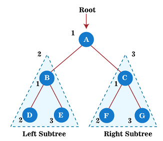

# Tree Traversal

Traversing a data structure means visiting each element of the respective data structure.

While linear data structures like Array, Linked List, Queue, and Stack allow traversal of their elements in a single manner, non-linear data structures like Tree enable traversal through multiple methods.

You can access my article on the topic through the Medium link: https://medium.com/@ozgurmehmetakif/tree-traversal-8a6d93883b06

Konu hakkındaki yazıma Medium linkinden ulaşabilirsiniz: https://medium.com/@ozgurmehmetakif/a%C4%9Fa%C3%A7-%C3%BCzerinde-dola%C5%9Fma-tree-traversal-36eb69d85424

  
